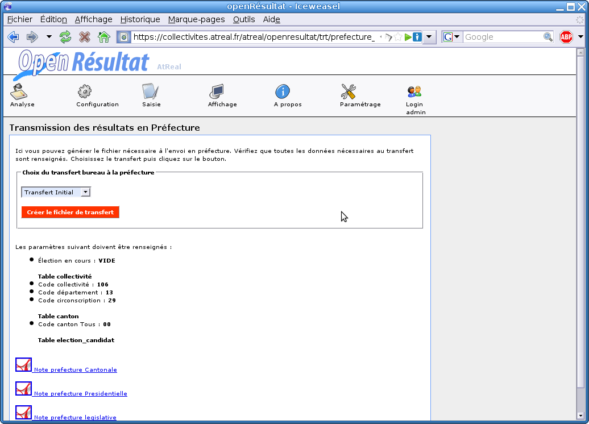

.. _affichages:

Affichages
==========

Affichage Web 
--------------

Tout au long du processus de configuration et de saisie de l’élection des fichiers sont transférés au site web de la ville, pour que les citoyens puissent consulter les résultats en direct de chez eux.

Cette rubrique nous permet de visualiser en local les fichiers qui sont transférés sur le site Web de la ville.

Le paramétrage de l'affichage Web est plutôt complexe pour un simple utilisateur puisqu'il faut modifier directement les fichiers de code.

Affichage animation 
--------------------

Tout au long de la journée électorale, les résultats sont affichés en direct sur un vidéo projecteur dans le hall de la mairie.
Cet affichage est actualisé à chaque saisie de résultats ou de participation.
Dans cette rubrique, on peut soit paramétrer l’affichage, soit visualiser l’affichage.

|picture_24|

Figure  : « Paramétrage et affichage de l'animation »

Paramétrage 
^^^^^^^^^^^^

Le paramétrage permet de choisir l’affichage des résultats ou de la participation pour l’élection sélectionnée. On peut également choisir le taux de rafraîchissement de la page.

|picture_0|

Figure  : « Paramétrage de l'affichage »

Affichage 
^^^^^^^^^^

L’affichage contient quatre parties : 

        - l’entête 

        - la liste des bureaux (=> arrivé, => non arrivé) 

        - la participation ou les résultats de la collectivité 

        - la participation ou les résultats pour un bureau en particulier 

Par contre pour les résultats, les chiffres de chaque bureau arrivent à des moments différents, donc seuls les résultats des bureaux arrivés défilent.

Pour la participation, les chiffres de tous les bureaux arrivent en même temps, donc tous les bureaux défilent l’un après l’autre en permanence à la cadence du taux de rafraîchissement de la page.

|picture_32|

Figure  : « Affichage des résultats »

Etats
-----

Une fois tous les résultats arrivés, l’édition d’un état au format pdf, permet de récupérer tous les chiffres par bureau par candidat.
Pour éditer des résultats, il suffit de cliquer sur l’élection souhaitée. 

|picture_1|

Figure  : « Etat pdf »

Le fichier pdf généré diffère selon le nombre de candidat.
En effet si le nombre de candidat est petit, on peut se contenter d’un état au format A4 en portrait, mais si le nombre de candidat est plus important on peut préférer avoir un état au format A3 en paysage.

Borne tactile
-------------

La borne tactile ressemble à l'affichage web et permet aux communes d'afficher les résultats sur une borne tactile en consultation à l'intérieur de la Mairie.

|picture_27|

Figure  : « Affichage borne tactile »

Transfert préfecture
--------------------

Ce menu n'apparaît que lorsque une élection est en cours.
Dans le menu « Affichage → Transmission préfecture ». Ici vous avez le choix entre le tranfert pour toutes les élections et le transfert pour les élections municipales.

|picture_15|

Figure  : « Tranfert préfecture »

Le transfert pour toutes les élections se présente ainsi.
Vérifiez que tous les paramètres demandés sont renseignés puis procédez à la création du fichier de transfert.
Une fois que vous avez récupéré votre fichier de transfert vous devez le transmettre à la Préfecture par le moyen de communication qu'ils ont mis en place (mail, formulaire, ...).

|picture_23|

Figure  : « Tranfert préfecture »

