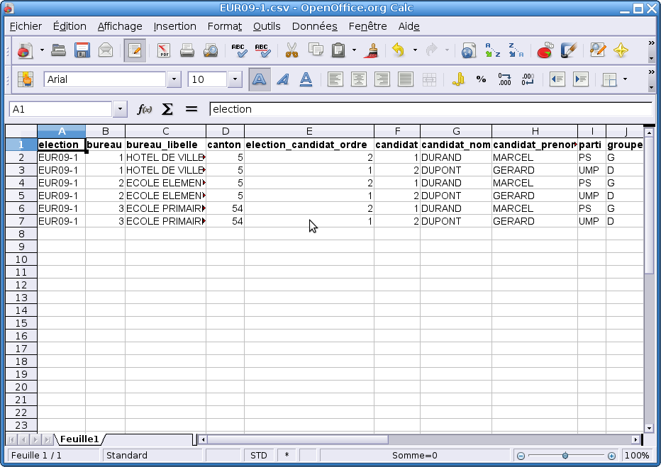

.. _analyse:

Analyse 
========

Ce menu nous permet de visualiser les résultats électoraux archivés, ceux dont l'élection n'est plus en cours et a été correctement archivée. 

Résultats 
----------

Pour la collectivité 
^^^^^^^^^^^^^^^^^^^^^

Cette analyse permet de visionner les résultats pour une élection en particulier, d’abord on visualise un tableau contenant la liste des élections (dont les élections première centaine) archivées.
Ensuite il y a deux possibilités pour visualiser les résultats d’une élection en particulier: soit en cliquant sur l’icône pdf , soit en cliquant sur l’enregistrement.

Pour un bureau 
^^^^^^^^^^^^^^^

Pour cette analyse, il nous faut d’abord sélectionner un bureau dans le premier tableau, puis un deuxième tableau apparaît avec les élections qui concernent ce bureau.
Alors on sélectionne une élection, pour obtenir les résultats de ce bureau pour cette élection.

Taux de participation 
----------------------

Par élection 
^^^^^^^^^^^^^

Cette rubrique nous permet de visualiser directement la liste des élections avec le taux de participation et le taux d’abstention.

Par bureau 
^^^^^^^^^^^

Cette analyse permet de visionner les taux de participation et d’abstention pour toutes les élections mais pour un bureau en particulier, d’abord on visualise un tableau contenant la liste des bureaux dans la base dans la table bureau.
Ensuite il y a deux possibilités pour visualiser les taux d’un bureau: soit en cliquant sur l’icône pdf , soit en cliquant sur l’enregistrement.

Taux de blancs et nuls 
-----------------------

Par élection 
^^^^^^^^^^^^^

Cette rubrique nous permet de visualiser directement la liste des élections avec le taux de votes blancs ou nul et le taux d’exprimés. 

Par bureau 
^^^^^^^^^^^

Cette analyse permet de visionner les taux de votes blancs ou nuls et d’exprimés pour toutes les élections mais pour un bureau en particulier, d’abord on visualise un tableau contenant la liste des bureaux dans la base dans la table bureau.
Ensuite il y a deux possibilités pour visualiser les taux d’un bureau: soit en cliquant sur l’icône pdf , soit en cliquant sur l’enregistrement.

Résultats obtenus par 
----------------------

Un candidat 
^^^^^^^^^^^^

Cette analyse permet de visionner le nombre de voix et le pourcentage d’un candidat pour toutes les élections auxquelles il a participé, d’abord on visualise un tableau contenant la liste des candidats dans la base dans la table candidat.
Ensuite il y a deux possibilités pour visualiser les résultats du candidat: soit en cliquant sur l’icône pdf , soit en cliquant sur l’enregistrement.

Un parti 
^^^^^^^^^

Cette analyse nous permet de visualiser, d’une manière identique à l’analyse par candidat, l’analyse pour un parti politique.

Un groupe 
^^^^^^^^^^

Cette analyse nous permet de visualiser, d’une manière identique à l’analyse par candidat, l’analyse pour un groupe politique.

Requêtes mémorisées
-------------------

Requêtes
^^^^^^^^

Le requêteur permet d’effectuer des requêtes personnalisées sur les tables de la base de données openresultat, et soit d’afficher le résultat dans un tableau, soit de l’exporter au format CSV.
Cela pemet ensuite d'intégrer les données à un tableur pour en extraire des statistiques personnalisées.

Export
^^^^^^

Cette fonction permet d'exporter les résultats vers un fichier CSV (compatible tableur : Microsoft Excel, OpenOffice Calc, …).

Cette méthode permet d'exporter les résultats de toutes les élections qu'elles soient en cours, archivées, première centaine ou seconde centaine.

|picture_35|

Figure  : « Export »

Ce fichier vous permet d'utiliser les résultats de l'élection pour toute édition particulière ou toute autre application externe à openRésultat.

