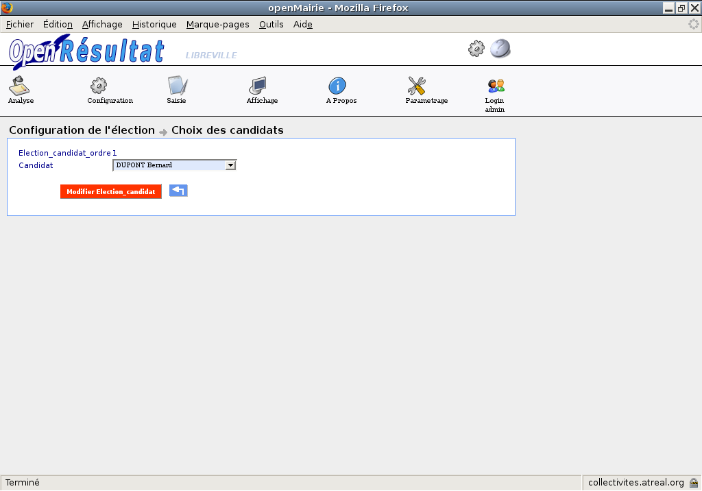

.. _configuration:

Configuration 
==============

Election(s) en cours
--------------------

Cet écran permet de sélectionner, d’ajouter ou de supprimer une élection, en effet lorsque l’on clique sur une élection, un paramètre de l'application sauvegarde le code de l'élection, et permet d'effectuer les différentes opérations sur l'élection.

Pour ajouter une élection on clique sur le bouton |picture_44| , pour supprimer sur le bouton |picture_7| et pour sélectionner sur le nom de l'élection.

|picture_2|

Figure  : « configuration élection en cours»

**Attention!** Au moment de la création de l'élection, les plans, les cantons, les bureaux de vote et si besoin les communes(regroupement) doivent être créés et configurés.

**Attention!** Lors de la suppression d'une élection (lors de tests par exemple), les données dans la base de données sont toutes supprimées, par contre les dossiers et fichiers créés pour l'animation et le web ne sont pas supprimés. Il peut se produire des erreurs si vous recréer une élection ayant le même identifiant (des résultats existants dans les affichages animation ou web).
Le plus efficace est de supprimer physiquement les dossiers avant de recréer l'élection.

Création de l’élection 
-----------------------

Pour pouvoir créer une élection, il faut sélectionner dans le menu Configuration la ligne Election(s) en cours.
Un tableau apparaît et permet de visualiser les élections en cours.
L’icône ajouter |picture_44| en haut à gauche du tableau permet d’obtenir un formulaire de création d’élection.

La configuration d’une élection commence par la création de celle-ci : nous pouvons choisir le type d’élection, la date, le libellé, le tour, le canton, le nombre de candidats, l’heure d’ouverture et l’heure de fermeture.

|picture_26|

Figure  : « création d'une élection»

ll faut remplir le formulaire et cliquer sur le bouton « Ajouter Election » pour valider.

Traitement effectué lors de la création: 

- une seconde élection est créée avec les mêmes paramètres pour gérer la première centaine de l'élection, son libellé est différent, il est suffixé de la mention « 1C »,

- une troisième élection est créée avec les mêmes paramètres pour gérer la seconde centaine de l'élection, son libellé est différent, il est suffixé de la mention « 2C »,

- les fichiers d'affichage web et d'animation sont créés et ou mis à jour.

Configuration de l’élection 
----------------------------

Une fois une élection sélectionnée dans le menu Configuration à la ligne Election(s) en cours.
Une page apparaît et permet de visualiser les informations sur l’élection en cours ainsi que trois sous formulaires (onglets) : config_candidat, config_bureau, verif_config.

|picture_33|

Figure  : « configuration élection en cours»

Configuration des candidats (onglet config_candidat)
^^^^^^^^^^^^^^^^^^^^^^^^^^^^^^^^^^^^^^^^^^^^^^^^^^^^

Le choix des candidats se présente sous la forme d’un tableau listant les numéros d’ordre pour l’élection en cours.
En cliquant sur un des numéros, on obtient un formulaire avec une liste de choix qui nous permet de sélectionner un candidat.

|picture_20|

Figure  : « choix des candidats»

Traitement(s) effectuée(s) :

- la modification s’effectue également sur l’enregistrement des simulations concernant ce numéro d’ordre,

- les fichiers d'affichage web et d'animation sont créés et ou mis à jour.

Configuration des inscrits par bureau (onglet config_bureau)
^^^^^^^^^^^^^^^^^^^^^^^^^^^^^^^^^^^^^^^^^^^^^^^^^^^^^^^^^^^^

Le nombre d’inscrits par bureau se présente de la même manière, à la différence que les valeurs sont déjà remplies par une requête sur la table electeur de la base openElec (voir menu: Configuration puis Transfert Inscrits).
La modification reste tout de même possible manuellement.

|picture_43|

figure  : « config_bureaux»

Traitement(s) effectué(s) : 

- la modification s’effectue également sur l’enregistrement des simulations concernant ce numéro d’ordre,

- les fichiers d'affichage web et d'animation sont créés et ou mis à jour.

Vérification de la configuration (onglet verif_config)
^^^^^^^^^^^^^^^^^^^^^^^^^^^^^^^^^^^^^^^^^^^^^^^^^^^^^^

Cet écran permet de visualiser que la configuration s’est effectuée correctement.

|picture_19|

Figure  : « verif_config »

Paramétrage des listes municipales
^^^^^^^^^^^^^^^^^^^^^^^^^^^^^^^^^^

En cas d’égalité de voix entre les listes arrivées en tête au second tour, les sièges sont attribués à la liste dont les candidats ont la moyenne d’âge la plus élevée. 

Dans le menu « Paramétrage → Liste municipale », cliquer sur la liste municipale à modifier et inscrire l'âge moyen de la liste.

|picture_9|

Figure  : « paramétrage liste municipale »

.. |picture_7| image:: picture_7.png
