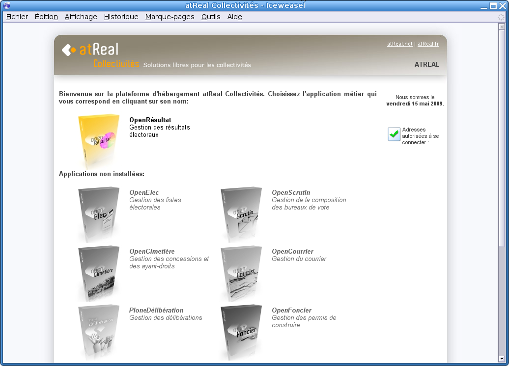
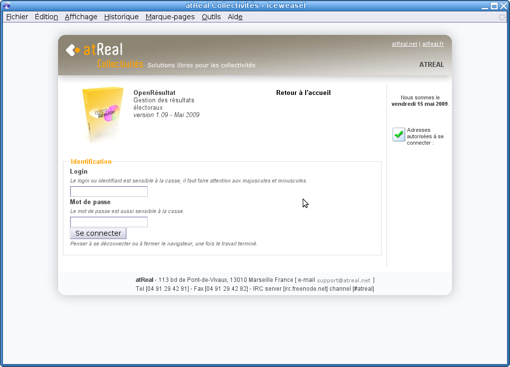
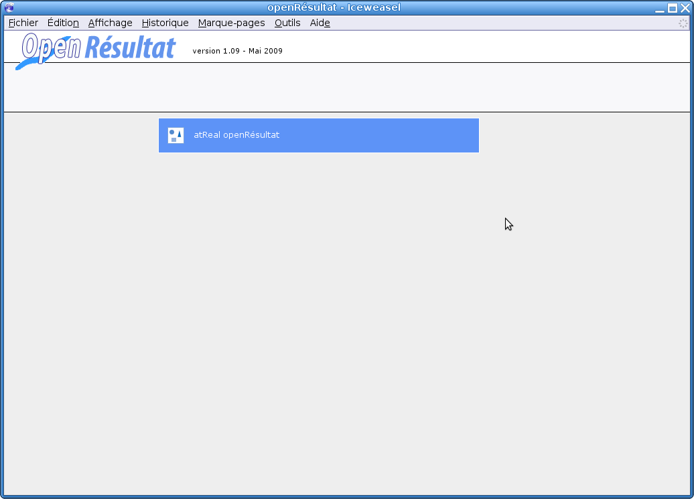
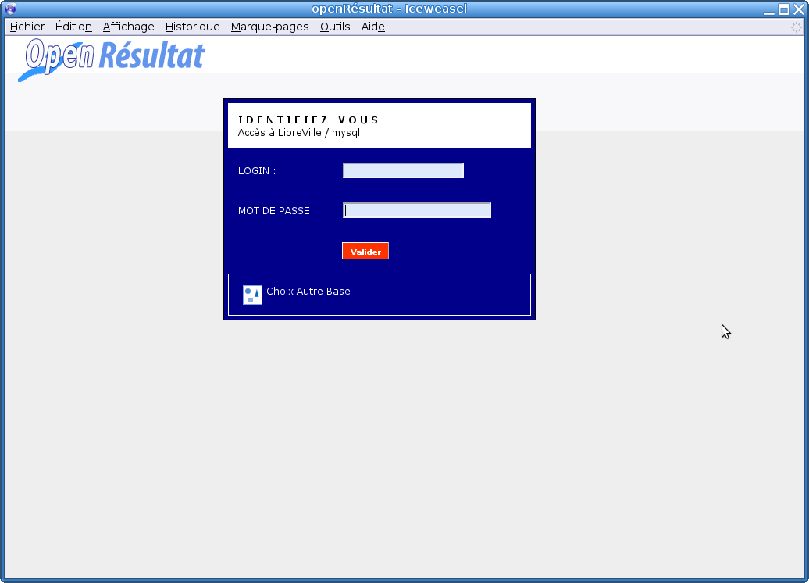
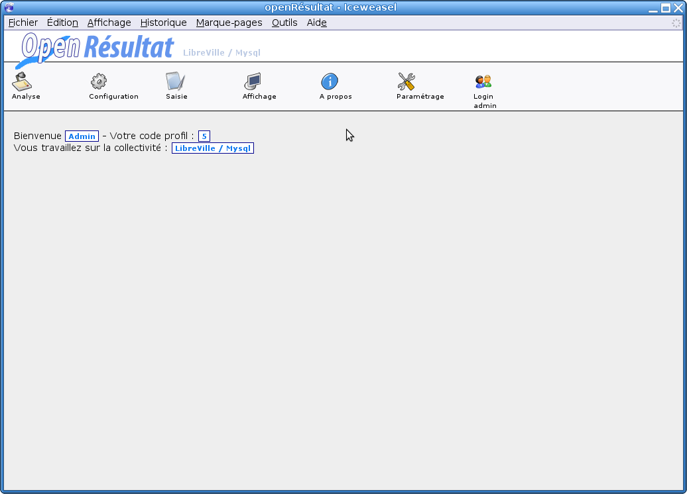
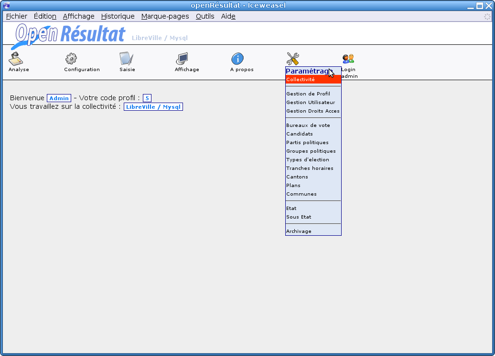
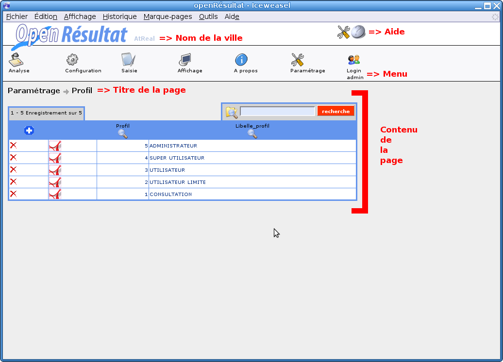

.. _ergonomie:

Ergonomie
*********

Cette partie vise à présenter l'ergonomie du logiciel c'est à dire à décrire la connexion à l'application, la structure de l'application, la navigation et l'utilisation du menu, ainsi que la présentation et la description des principaux icônes.
Cette rubrique peut s'appliquer à toute application métier développée avec OpenMairie.

Connexion
=========

La connexion à OpenRésultat se déroule en deux étapes : d'abord le choix de la collectivité ou de l'application et ensuite la saisie des informations de connexion de l'utilisateur.

Hébergement atReal Collectivités
--------------------------------

Lors d'un hébergement atReal Collectivités, vous avez accès à l'interface de choix de votre application.
En cliquant sur l'application openRésultat, vous aurez accès au formulaire d'identification.

|picture_11|

Figure  : « choix de l'application métier »

Cette figure présente l'écran d'identification, il faut saisir son login et son mot de passe puis cliquer sur le bouton « Valider ». Le login et le mot de passe doivent être saisis en respectant les minuscules et majuscules.
Si les identifiants entrés sont incorrects, un message d'erreur apparaît et il faut ressaisir les informations de connexion.

|picture_28|

Figure  : « identification »

Interface classique
-------------------

C'est le premier écran du logiciel, il contient uniquement des liens qui permettent d'entamer une connexion à l'application.

|picture_41|

Figure  : « choix de la collectivité »

Pour pouvoir se connecter à l'application, l'utilisateur doit demander à l'administrateur du logiciel un identifiant (ou login) et un mot de passe que l'administrateur aura préalablement configuré dans le logiciel.

|picture_12|

Figure *None* : « identification»

Les droits et profils des utilisateurs 
---------------------------------------

Une fois les informations saisies correctement, l'écran d'accueil (figure 3) affiche un message de bienvenue avec le nom et le profil de l'utilisateur ainsi que le nom de la collectivité. 

|picture_25|

Figure : « écran d'accueil»

Chaque utilisateur est associé à un profil.
Le profil est le niveau de droits de l'utilisateur, dans la configuration d'origine d'OpenRésultat, il existe cinq profils: 

        - Consultation, 

        - Utilisateur limité, 

        - Utilisateur, 

        - Super utilisateur, 

        - Administrateur.
          

Chaque page de l'application est associée à un profil.
Pour chaque accès à une page, l'application vérifie si l'utilisateur a un profil supérieur ou égal au profil de la page consultée, si c'est le cas l'utilisateur à donc le droit d'accéder aux informations.

Structure de l'application 
===========================

La structure graphique (figure suivante) se présente à tout moment de la même manière.
Elle permet donc à l’utilisateur de toujours trouver les outils au même endroit et de se repérer rapidement.

|picture_16|

Figure  : « structure de l'application»

Le menu est divisé en sept rubriques qui se déplient au passage de la souris.
Chaque rubrique contient plusieurs liens permettant d'accéder aux différentes pages du logiciel.

|picture_5|

Figure  : « menu»

Les icônes clés 
================

Grâce à OpenMairie, l'application utilise beaucoup d'icônes représentant souvent les mêmes fonctionnalités. 

|picture_44| Ajout d'un élément,

|picture_7| Suppression d'un élément,

|picture_29| Modification d'un élément,

|picture_40| Aide,

|picture_34| Edition d'un pdf,

|picture_3| Recherche sur cet élément,

|picture_37| Retour à la page précedente.

Sensibilisation des utilisateurs 
=================================

Ce logiciel, comme la plupart des logiciels OpenMairie, demande une grande rigueur d'utilisation.
En effet, cette application étant une solution Web, certaines actions sont permises à l'utilisateur alors qu'elles pourraient altérer les données de l'application: 

  - il ne faut en aucun cas cliquer sur l'icone « Précédent » ou « Suivant » du navigateur Web, 

  - il faut suivre catégoriquement la chronologie de l'application.

.. |picture_7| image:: picture_7.png

.. |picture_29| image:: picture_29.png

