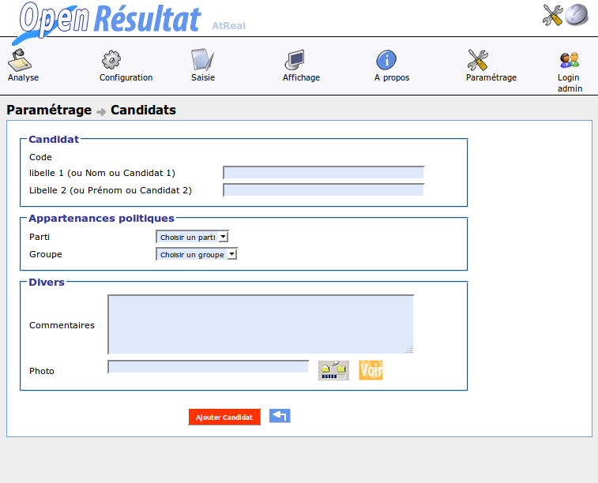

.. _parametrage:

Paramétrage
===========

Tous les paramétrages se font par l’intermédiaire de formulaires.
Dans l’optique openMairie, l’application présente un tableau permettant de choisir l’enregistrement à modifier ou à supprimer, ou de créer un nouvel enregistrement.
Les éléments paramétrables sont : 

  - collectivité : le maire, le nombre de sièges CM, le code insee…

  - utilisateur : login, mot de passe et profil des utilisateurs.

  - profil : les différents profil de sécurité.

  - droit : l'association entre un objet et son profil d'accès.

  - plan : les plans pour l'affichage web...

  - canton : les cantons, leur code préfecture...

  - bureau : les bureaux de vote, leur canton, leur position sur un plan...

  - commune : pour le regroupement en cas d'élection législative ou cantonale...

  - tranche : 

  - type élection :

  - parti :

  - candidat : 

  - groupe : 

  - liste municipale :

L’utilisateur doit faire attention au fait que s’il supprime un enregistrement utilisé dans d’autres tables, des données seront inutilisables.

Collectivité
------------

Vous accédez au paramétrage par le menu « Paramétrage ->Collectivité », puis en cliquant sur le nom du maire, vous allez accéder au formulaire de modification

|picture_22|

Figure  : « affichage de la collectivité »

La ville et le Maire sont utilisés pour l'affichage dans tous les documents de l'application.
Les champs supplémentaires sont le nombre de sièges au conseil municipal, le numéro de département sur deux chiffres, le code commune Insee sur trois chiffres, le numéro de circonscription.
Pour valider on clique sur le bouton « Modifier Collectivité ».

|picture_30|

Figure  : « formulaire de la collectivité »

Commune et notion de regroupement
---------------------------------

Le regroupement est utile pour des élections comme les cantonales ou les législatives car les résultats définitifs dépendent des résultats d'autres communes du même canton.

Par exemple, le soir des élections législatives les communes d'Istres, de Martigues et de Port de Bouc se communiquent les résultats globaux de la commune pour permettre un affichage via l'animation.

Pour gérer ces regroupements, il suffit de créer une commune et de cocher la case valide pour qu'à la création de l'élection les entrées correspondantes soient créées.

Nous allons créer une commune pour notre propre commune, puis pour celles aux alentours disposées à vous transmettre les résultats le soir des élections pour que vous puissiez produire un affichage global de votre canton.

|picture_36|

Figure  : « formulaire de la commune »

Par exemple, avec ce paramétrage, lors de la création de l'élection, nous aurons la possibilité de saisir des résultats pour la commune « atReal » et « Aubagne » mais pas pour « Arles ». 

L'utilité est que pour une élection nous pouvons avoir un regroupement avec Arles et pour une autre élection un regroupement avec Aubagne.

Donc avant la création de l'élection, il faut valider ou non les communes faisant partie ou non du regroupement pour l'élection en question.

|picture_39|

Figure  : « affichage des communes »

Candidats
---------

Lors de la création d'un candidat, le parti et le groupe auxquels il appartient doivent avoir été créé.

Lors d'une élection municipale ou européenne ou quelconque élection dans laquelle une liste est candidate, il suffit de remplir le nom de la liste dans le champ nom et de remplir le champ prénom avec un espace.

|picture_13|

Figure  : « formulaire du candidat »

.. |picture_22| image:: picture_22.png

