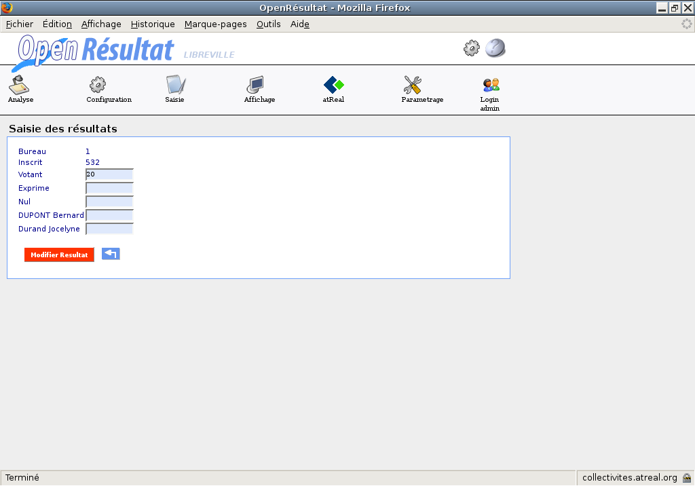

.. _saisie:

Saisie 
=======

Saisie de la participation 
---------------------------

Choix de l'heure de la saisie
^^^^^^^^^^^^^^^^^^^^^^^^^^^^^

La saisie de la participation se fait toutes les deux heures ou toutes les heures selon le choix lors de la création de l'élection.
Un tableau listant toutes les tranches horaires auxquelles doivent être saisies les participations de chaque bureau apparaît à l'écran.
Puis en cliquant sur la tranche horaire, on accède à un formulaire permettant de modifier la participation pour tous les bureaux.

|picture_10|

Figure  : « saisie de la participation»

Formulaire de saisie de la participation
^^^^^^^^^^^^^^^^^^^^^^^^^^^^^^^^^^^^^^^^

|picture_4|

Figure : « Saisie de la participation »

Traitement(s) effectué(s) : 

- la modification s’effectue également sur l’enregistrement de la première centaine en notant 100 si le nombre de votants est supérieur à 100 et le nombre de votants s'il est inférieur,

- la modification s’effectue également sur l’enregistrement de la seconde centaine en notant 200 si le nombre de votants est supérieur à 200 et le nombre de votants s'il est inférieur,

- les fichiers d'affichage web et d'animation sont créés et ou mis à jour.

Saisie de la première centaine 
-------------------------------

Une fois une élection sélectionnée dans le menu Saisie à la ligne Election(s) en cours.
Une page apparaît et permet de visualiser les informations sur l’élection en cours ainsi que trois sous formulaires (onglets) : saisie_bureau, verif_saisie, result.

|picture_21|

Figure  : « Saisie simulation ou première centaine »

Saisie des résultats pour un bureau (onglet saisie_bureau) 
^^^^^^^^^^^^^^^^^^^^^^^^^^^^^^^^^^^^^^^^^^^^^^^^^^^^^^^^^^^

Le tableau listant les bureaux contient un champ état, qui nous permet de déterminer si le bureau est saisi ou non :

        - Les résultats pour ce bureau ne sont pas arrivés. 

        - Les résultats pour ce bureau sont arrivés. 

        - Les résultats pour ce bureau sont arrivés mais il y a des erreurs.
          

Lors de la saisie, une vérification est faite sur deux critères : 

        - Votants = Nuls + Exprimés 

        - Exprimés = Somme (Candidats) 

Si une de ces égalités n’est pas vérifiée, alors un message d’erreur est affiché et l’état erreur est affecté au bureau.

|picture_31|

Figure  : « Saisie des résultats pour un bureau »

Traitement(s) effectué(s) : 

- on modifie l’état du bureau selon le résultat des tests de vérification effectués,

- les fichiers d'affichage web et d'animation sont créés et ou mis à jour.

Vérification de la saisie (onglet verif_saisie) 
^^^^^^^^^^^^^^^^^^^^^^^^^^^^^^^^^^^^^^^^^^^^^^^^

Cet écran permet de visualiser que la saisie s’est effectuée correctement.

|picture_18|

Figure  : « Vérification de la saisie par bureau »

Visualisation des résultats (onglet result) 
^^^^^^^^^^^^^^^^^^^^^^^^^^^^^^^^^^^^^^^^^^^^

Cet écran nous permet de voir le calcul des résultats, et donc le pourcentage de chaque candidat.

|picture_17|

Figure  : « Résultats provisoires par candidat »

Saisie de la seconde centaine
-----------------------------

La saisie des résultats se déroule exactement comme la saisie de la première centaine.

Saisie des résultats 
---------------------

La saisie des résultats se déroule exactement comme la saisie de la première centaine et de la deuxième centaine.

.. |picture_17| image:: picture_17.png

